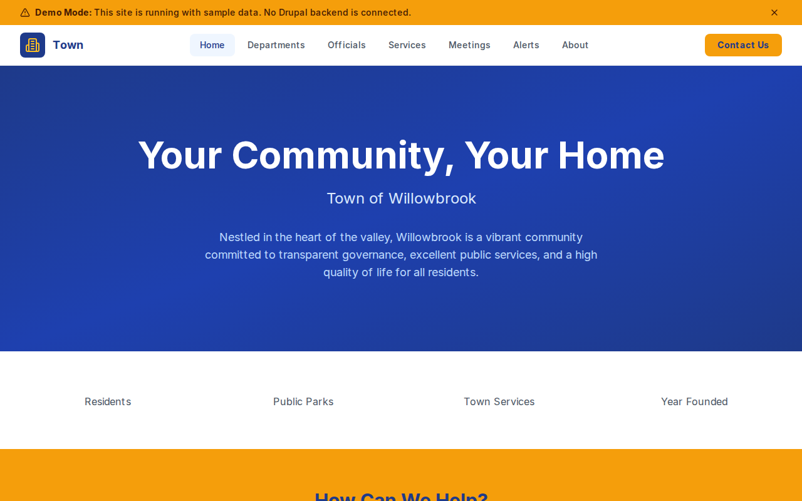

# Decoupled Town

A municipal government website starter for Decoupled Drupal + Next.js. Built for towns, townships, boroughs, and small municipal governments to provide transparent governance, public service information, and community engagement.



## Features

- **Departments** - Town government departments with contact info, office hours, and responsibilities
- **Officials** - Elected officials and appointed leaders with bios, positions, and contact details
- **Services** - Resident services like building permits, water billing, recreation programs, and trash collection
- **Meetings** - Town council meetings, planning board sessions, and public hearings with agendas and locations
- **Alerts** - Emergency alerts, weather warnings, and public advisories with severity levels and affected areas
- **Modern Design** - Clean, accessible UI with a civic blue and amber color palette

## Quick Start

### 1. Clone the template

```bash
npx degit nickstoneman/decoupled-town my-town
cd my-town
npm install
```

### 2. Run interactive setup

```bash
npm run setup
```

This interactive script will:
- Authenticate with Decoupled.io (opens browser)
- Create a new Drupal space
- Wait for provisioning (~90 seconds)
- Configure your `.env.local` file
- Import sample content

### 3. Start development

```bash
npm run dev
```

Visit [http://localhost:3000](http://localhost:3000)

---

## Manual Setup

If you prefer to run each step manually:

<details>
<summary>Click to expand manual setup steps</summary>

### Authenticate with Decoupled.io

```bash
npx decoupled-cli@latest auth login
```

### Create a Drupal space

```bash
npx decoupled-cli@latest spaces create "My Town"
```

Note the space ID returned (e.g., `Space ID: 1234`). Wait ~90 seconds for provisioning.

### Configure environment

```bash
npx decoupled-cli@latest spaces env 1234 --write .env.local
```

### Import content

```bash
npm run setup-content
```

This imports:
- Homepage with hero, statistics, and call-to-action sections
- 4 Departments (Administration, Public Works, Parks & Recreation, Public Safety)
- 3 Officials (Mayor Patricia Reynolds, Town Manager David Chen, Police Chief Maria Gonzalez)
- 4 Services (Building Permits, Water & Sewer Billing, Recreation Programs, Trash & Recycling)
- 3 Meetings (Town Council, Planning Board, Public Hearing)
- 3 Alerts (Water Main Repair, Winter Storm Warning, Main Street Closure)
- 2 Static Pages (About, Contact)

</details>

## Content Types

### Department
- Title, Body (description and responsibilities)
- Phone, Email, Location, Office Hours
- Department Category (taxonomy)
- Department Image

### Official
- Title (name), Body (biography)
- Position/Title, Department
- Email, Phone, Office Location
- Photo

### Service
- Title, Body (description and instructions)
- Department, Online Service URL
- Eligibility, Fee
- Service Image

### Meeting
- Title, Body (agenda and details)
- Meeting Date, End Date, Location
- Meeting Type (taxonomy: Town Council, Planning Board, Public Hearing)
- Agenda URL, Meeting Image

### Alert
- Title, Body (details and instructions)
- Alert Level (taxonomy: Emergency, Warning, Advisory)
- Effective Date, Expiration Date
- Affected Area

## Customization

### Colors & Branding
Edit `tailwind.config.js` to customize colors, fonts, and spacing. The default palette uses navy blue with amber accents.

### Content Structure
Modify `data/town-content.json` to add or change content types and sample content.

### Components
React components are in `app/components/`. Update them to match your town's design needs.

## Demo Mode

Demo mode allows you to showcase the application without connecting to a Drupal backend. It displays mock content for the homepage, departments, officials, services, meetings, and alerts.

### Enable Demo Mode

Set the environment variable:

```bash
NEXT_PUBLIC_DEMO_MODE=true
```

Or add to `.env.local`:
```
NEXT_PUBLIC_DEMO_MODE=true
```

### What Demo Mode Does

- Shows a "Demo Mode" banner at the top of the page
- Returns mock data for all GraphQL queries
- Displays sample departments, officials, services, meetings, and alerts
- No Drupal backend required

### Removing Demo Mode

To convert to a production app with real data:

1. Delete `lib/demo-mode.ts`
2. Delete `data/mock/` directory
3. Delete `app/components/DemoModeBanner.tsx`
4. Remove `DemoModeBanner` from `app/layout.tsx`
5. Remove demo mode checks from `app/api/graphql/route.ts`

## Deployment

### Vercel (Recommended)
[](https://vercel.com/new/clone?repository-url=https://github.com/nickstoneman/decoupled-town)

Set `NEXT_PUBLIC_DEMO_MODE=true` in Vercel environment variables for a demo deployment.

### Other Platforms
Works with any Node.js hosting platform that supports Next.js.

## Documentation

- [Decoupled.io Docs](https://www.decoupled.io/docs)
- [Next.js Documentation](https://nextjs.org/docs)
- [Drupal GraphQL](https://www.decoupled.io/docs/graphql)

## License

MIT
